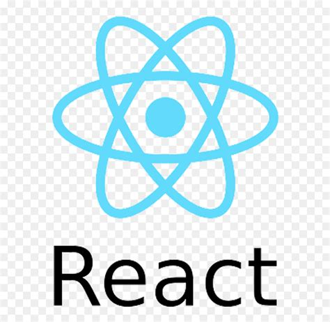
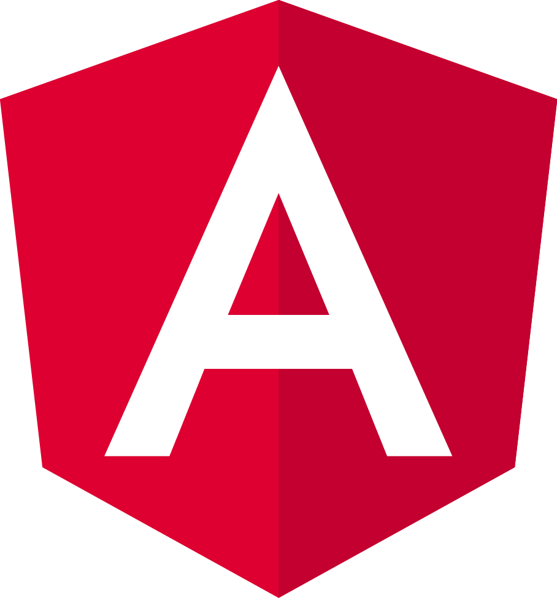
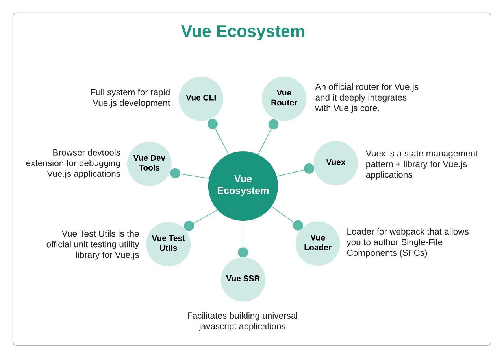
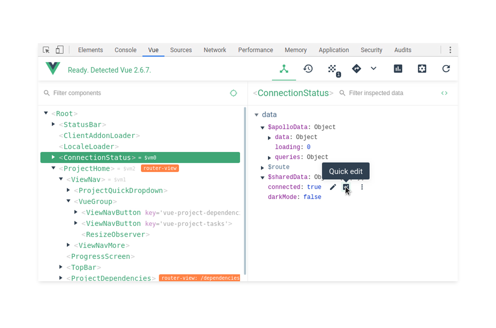

# Introduction à VueJs 
__Formateur:__ Ludovic Laloux
 https://github.com/ludolaloux13

---

# Qui suis-je ?

* **2015 - 2018 :** Chargé de projets au service de formation continue - INP Toulouse 
* **2018-2019 :** D.U. Full Stack à l'N7
* **2019**: Stage Développeur Frontend VueJs - Guidap
* **2020 - 2022 :** Développeur Full Stack JS - June Factory (Scassi) 

--- 

# Contexte

Créé et toujours maintenu par **Evan You** (ingénieur Google) depuis 2013
_Projet intial :_ prendre le meilleur de Angular dans un framework plus léger

---

# Versions

- **2016 :** VueJs 2
- **février 2022 :** VueJs 3 

**Doc officielle :**  
 Vue 2 has now entered maintenance mode: it will no longer ship new features, but will continue to receive critical bug fixes and security updates for 18 months starting from the 2.7 release date. This means **Vue 2 will reach End of Life by the end of 2023**.

--- 

### 3 Frameworks majoritaires
Svelte, Ember...

--- 

---

# Vue CLI (Vue 2) --> Vite (Vue 3)

https://vitejs.dev/

- Abandon de webpack
- 

---

# VueDevTools 
https://devtools.vuejs.org/ 

:rotating_light: à installer dans votre navigateur pour ce cours !

---

# VueJs 3 

- Vue router
- VueX --> Pinia
- VuePress --> 
- Vue CLI --> Vite

