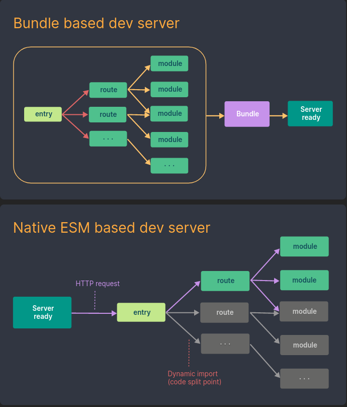
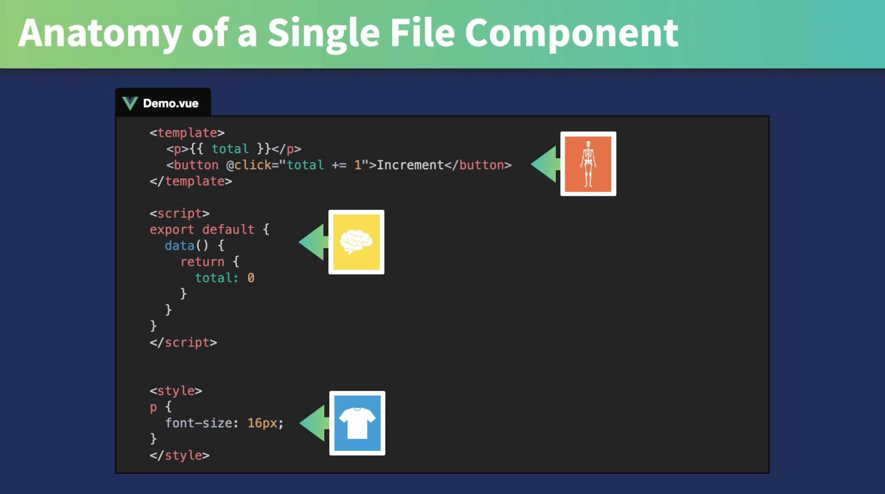

<!-- slide 1 -->

# Introduction à VueJs

**Formateur:** Ludovic Laloux
 https://github.com/ludolaloux13

---

<!-- slide 2 -->

# Qui suis-je ?

---

<!-- slide 3 -->

# Création de VueJs

- Créé et toujours maintenu par **Evan You** (ingénieur Google) depuis 2013
- _Projet intial :_ prendre le meilleur de Angular dans un framework plus léger
- Montée en puissance progressive
- Vue 2 devient un framework incontournable

---

<!-- slide 4 -->

### 3 Frameworks majoritaires

Svelte, Ember...

---

<!-- slide 5 -->

# Evolutions majeures

- **2016 :** VueJs 2
- **février 2022 :** VueJs 3

**Doc officielle :**  
 Vue 2 has now entered maintenance mode: it will no longer ship new features, but will continue to receive critical bug fixes and security updates for 18 months starting from the 2.7 release date. This means **Vue 2 will reach End of Life by the end of 2023**.

---

<!-- slide 6 -->

---

<!-- slide 7 -->

# Vue CLI + Webpack (Vue 2) --> Vite (Vue 3)

https://vitejs.dev/

- Abandon du projet Vue CLI car trop dépendant de Webpack
- Permet de créer un projet et de servir le bundle pour le dev et la prod

---

<!-- slide 8 -->

# VueDevTools

https://devtools.vuejs.org/

:rotating_light: à installer dans votre navigateur pour ce cours !

---

<!-- slide 9 -->

# Vue router

https://router.vuejs.org/

- Permet de mapper des composants sur des routes
- par ex: HelloWorld.vue --> http://mywebsite/helloword

---

<!-- slide 10 -->

# Pinia (ex VueX)

https://pinia.vuejs.org/

- State management library
- Permet de stocker et passer la donnée entre les composants

---

# Vitepress (Vuepress)

https://vitepress.vuejs.org/

Génération de documentation au format Markdown

---

---

# SFC (Single File Component)

